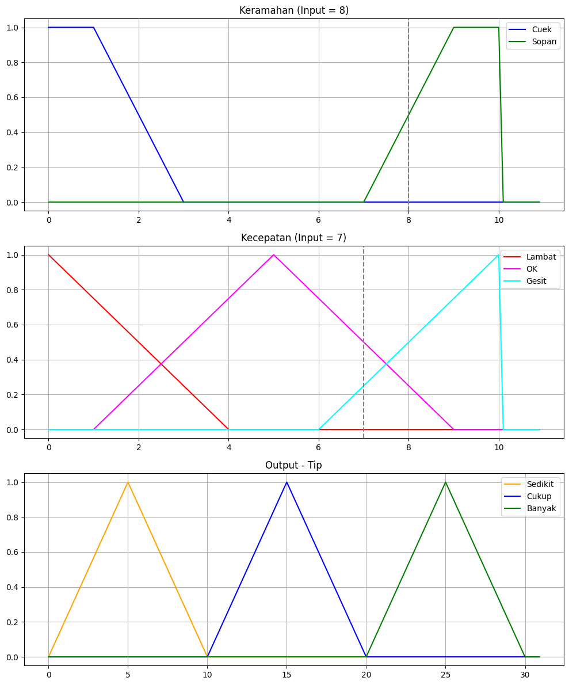
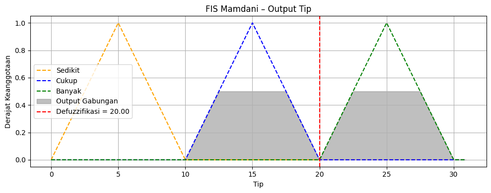

# Fuzzy Logic for Tip Prediction 🍽️

Proyek ini menggunakan sistem inferensi fuzzy (**Fuzzy Inference System / FIS**) dengan metode **Mamdani** untuk menghitung besarnya tip berdasarkan dua parameter input:

- **Keramahan (0–10)**
- **Kecepatan Pelayanan (0–10)**

---

## 🔍 Fuzzy Membership Functions

### Input: Keramahan
- **Cuek**: dari 0 ke 1 (derajat keanggotaan 1), menyilang ke 3 (turun ke 0)
- **Sopan**: dari 7 ke 9 (naik), lanjut ke 10 (tetap 1)

### Input: Kecepatan
- **Lambat**: dari 0 ke 4 (turun)
- **OK**: dari 1 ke 5 (naik), lalu 5 ke 9 (turun)
- **Gesit**: dari 6 ke 10 (naik)

### Output: Tip
- **Sedikit**: dari 0 ke 5 (naik), 5 ke 10 (turun)
- **Cukup**: dari 10 ke 15 (naik), 15 ke 20 (turun)
- **Banyak**: dari 20 ke 25 (naik), 25 ke 30 (turun)

---

## 🧠 Fuzzy Rules
- Rule 1: Jika kecepatan lambat atau keramahan cuek, maka tip = sedikit
- Rule 2: Jika kecepatan OK, maka tip = cukup
- Rule 3: Jika kecepatan gesit atau keramahan sopan, maka tip = banyak

---

## 🧪 Contoh Kasus

### Input
- Kecepatan: `7`
- Keramahan: `8`

### Rules Fuzzy
- Rule 1 (Sedikit) = max(0.00, 0.00) = 0.00
- Rule 2 (Cukup) = 0.50
- Rule 3 (Banyak) = max(0.50, 0.25) = 0.50

---

## 🔢 Defuzzifikasi (Metode Mamdani)
- Metode: Centroid
- Output Expect Perhitungan Manual: 20%

---

## 📊 Visualisasi

### Fungsi Keanggotaan Input

### Hasil Agregasi dan Defuzzifikasi

---

## 🛠️ Cara Menjalankan

1. Buka file `Fuzzy_Tip.ipynb` di Google Colab atau Jupyter Notebook.
2. Jalankan semua cell untuk melihat:
   - Visualisasi keanggotaan
   - Derajat keanggotaan input
   - Evaluasi aturan fuzzy
   - Hasil akhir defuzzifikasi tip

---
